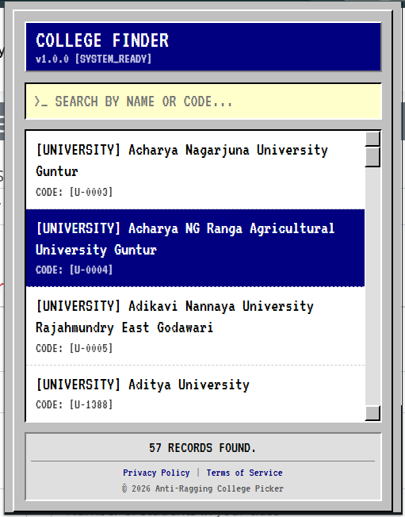

<div align="center">


# Anti-Ragging College Picker

**A retro-styled Chrome extension that makes finding and selecting your college on the Anti-Ragging Portal fast and effortless.**

[](https://developer.chrome.com/docs/extensions/mv3/)
[](#)
[](#license)

Instantly see and select your college on the Anti-Ragging website — no endless scrolling.

[Install](#installation) · [How to Use](#how-to-use) · [Privacy & Legal](#privacy--legal)

<br/>



</div>

---

## 🎯 What It Does

The official anti-ragging website requires students to manually scroll through **thousands** of colleges in a dropdown to file a complaint or register. This extension injects a powerful, instant-search popup directly into your browser so you can:

- **Search by name** — Type any part of your college name and get results instantly.
- **Search by code** — Enter the `C-XXXXX` or `U-XXXXX` code to jump straight to your institution.
- **One-click selection** — Click a result and the extension automatically fills the dropdown on the page for you.

---

## 🚀 Installation

### From Source (Developer Mode)

1. **Clone the repository**
   ```bash
   git clone https://github.com/your-username/anti-ragging-extension.git
   ```
2. **Open Chrome** and navigate to `chrome://extensions/`
3. **Enable Developer Mode** (toggle in the top-right corner)
4. Click **"Load unpacked"** and select the cloned project folder
5. The extension icon will appear in your toolbar — you're ready to go!

---

## 📖 How to Use

1. Navigate to the [Anti-Ragging Portal](https://www.antiragging.in/) (or any page with the college/university dropdown).
2. Click the **College Picker** extension icon in the Chrome toolbar.
3. Start typing your college name or code in the search bar.
4. Click on your college from the filtered results.
5. The extension will automatically select it in the dropdown on the page.

---

## 🔒 Privacy & Legal

- [Privacy Policy](src/legal/privacy.html) — We collect **zero** personal data.
- [Terms of Service](src/legal/terms.html) — Use at your own discretion; provided as-is.

---

## 📄 License

This project is licensed under the MIT License.
