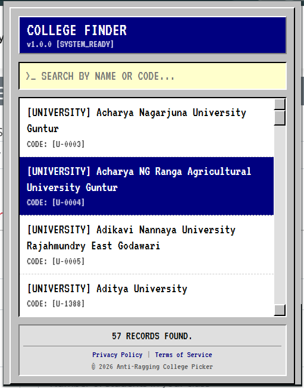

<div align="center">


# Anti-Ragging College Picker

**A retro-styled Chrome extension that makes finding your college and filling out the Anti-Ragging Portal fast and effortless.**

[](https://developer.chrome.com/docs/extensions/mv3/)
[](#)
[](#license)

Instantly see and select your college, save your details, and automatically fill out forms on the Anti-Ragging website.

[Install](#installation) · [How to Use](#how-to-use) · [Privacy & Legal](#privacy--legal)

<br/>



</div>

---

## 🎯 What It Does

The official anti-ragging website requires students to manually scroll through **thousands** of colleges in a dropdown and manually fill out repetitive forms. This extension injects a powerful, instant-search popup and an auto-fill engine directly into your browser so you can:

- **Search by name** — Type any part of your college name and get results instantly.
- **Search by code** — Enter the `C-XXXXX` or `U-XXXXX` code to jump straight to your institution.
- **One-click selection** — Click a result and the extension automatically fills the dropdown on the page for you.
- **Smart Form Auto-Fill** — Automatically fills previously saved details on the anti-ragging forms (names, contact details, checkboxes) with visual indicators.
- **Secure Local Saving** — Prompts you to save your data locally when submitting a form so you can reuse it later.

---

## ✨ What's New in 2.0

- **Form Auto-Filler Engine**: Effortlessly populate complex multi-page anti-ragging forms using securely saved local data.
- **Visual Feedback Enhancements**: Beautiful "Siri-glow" animations to highlight exactly which fields the extension has automatically filled for you.
- **Smart Save Modal**: Intercepts form submissions to securely save your form details on your machine for the next time.
- **Retro Win95 Interface**: Nostalgic aesthetic with clean UI elements.
- **Improved Site Support**: Works seamlessly on both `antiragging.in` and `www.antiragging.in`.

---

## 🚀 Installation

### From Source (Developer Mode)

1. **Clone the repository**
   ```bash
   git clone https://github.com/your-username/anti-ragging-extension.git
   ```
2. **Open Chrome** and navigate to `chrome://extensions/`
3. **Enable Developer Mode** (toggle in the top-right corner)
4. Click **"Load unpacked"** and select the cloned project folder
5. The extension icon will appear in your toolbar — you're ready to go!

---

## 📖 How to Use

### Finding Your College
1. Navigate to the [Anti-Ragging Portal](https://www.antiragging.in/) (or any page with the college/university dropdown).
2. Click the **College Picker** extension icon in the Chrome toolbar.
3. Start typing your college name or code in the search bar.
4. Click on your college from the filtered results.

### Auto-Filling Forms
1. Fill out your details manually on the Anti-Ragging Portal for the first time.
2. Upon submitting the form, the extension will prompt a **Save Modal**. Choose "Save Details".
3. The next time you encounter an anti-ragging form, the extension will **automatically fill** your saved details and highlight them with a glowing animation!

---

## 🔒 Privacy & Legal

- [Privacy Policy](src/legal/privacy.html) — We collect **zero** personal data. All auto-fill data is stored locally on your device.
- [Terms of Service](src/legal/terms.html) — Use at your own discretion; provided as-is.

---

## 📄 License

This project is licensed under the MIT License.
